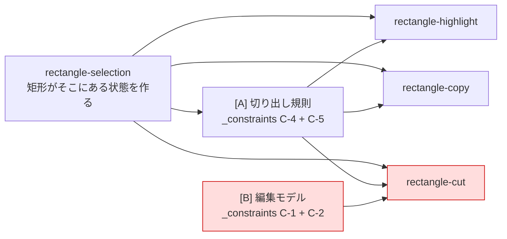

# 矩形モード実装: behavior 間の依存関係と並列性

対象区間: ROADMAP「矩形のカット/削除まで」。
`docs.local/behavior/` の各振る舞い定義を**ノード**として、何が並列にでき、何が直列依存かを整理する。
※ ここは「どう作るか」の手前の作業計画。具体設計は openspec design、スコープ切り出しは requirement-definition の領域。

## 関連するドキュメント

- `docs.local/behavior/rectangle-selection.md`
- `docs.local/behavior/rectangle-highlight.md`
- `docs.local/behavior/rectangle-copy.md`
- `docs.local/behavior/rectangle-cut.md`
- `docs.local/_constraints.md`

---

## まず: `_constraints.md` は依存プロファイルの違う2本の土台に割れる

横断制約はひとまとまりに見えるが、実装の依存関係上は**全く性質の違う2つ**に分かれる。これが整理の鍵。

| 土台 | 中身 | 誰が要るか | 性質 |
|---|---|---|---|
| **A. 切り出し規則** | C-4(visual column マッピング) ＋ C-5(短い行=空・差し替え可能) = 「矩形(行×列) → 各行の char range」 | ハイライト / コピー / カット **全部** | 3能力が**共有する単一規則**（分岐させない） |
| **B. 編集モデル** | C-1(undo 原子性) ＋ C-2(不連続領域を1リビジョン) | **カットだけ** | 選択・読み取り系と**直交**（編集層のみ） |

- C-3(後方互換) と C-4/C-5/C-1/C-2 の禁止系は、全ノードに常時かかる「越えてはいけない線」。依存の矢印にはならない。

---

## behavior 間の依存グラフ



読み方:
- **rectangle-selection が根**。矩形という対象がまず無いと、ハイライトもコピーもカットも始まらない。
- **[A]切り出し規則は selection の上に立ち、ハイライト/コピー/カットの3つが共有**する。見た目・コピー結果・削除範囲が一致する保証（C-4）はここに集約。
- **[B]編集モデルは右に独立して立ち、カットにしか刺さらない**。selection や [A] とは矢印で繋がらない＝**並列**。

---

## 関係性の要点（behavior 軸）

### 1. ハイライトとコピーは「読み取り三角形」、編集モデルを待たない
- `rectangle-highlight` と `rectangle-copy` の依存は **selection ＋ [A]切り出し規則 だけ**。
- どちらも diff empty（バッファを変えない）＝ [B]編集モデルと無関係。
- 互いにも独立（ハイライトは描画層、コピーは clipboard 層）。→ **2つ同時に進められる**。

### 2. カットだけが「全部乗せ」
- `rectangle-cut` = selection ＋ [A]切り出し規則 ＋ [B]編集モデル。
- [A]の切り出し規則は**コピーと完全に同一のものを共有**する（`_constraints` C-5: 3者で分岐しない）。カットの「何を消すか」はコピーの「何を取るか」と同じ。
- [B]編集モデルだけがカット固有の重し。

### 3. [B]編集モデルは selection と完全並列で、しかも最重量
- 触る層が違う（編集・undo層 vs 選択状態・描画・clipboard層）。selection / ハイライト / コピーのどれともブロックし合わない。
- だが C-1/C-2 を満たす機構（複合 diff / revision に複数 diff / バウンディング近似）が**この区間最大の不確実性**。→ 早く着手して潰す価値が最大。

---

## 進める順序（behavior 軸の波）

### 波1（並列）
- **rectangle-selection**（根。矩形の座標型＝行範囲×visual column を確定させる）
- **[B]編集モデル**（selection と直交。最重量なので最優先で並走、機構決定を真っ先に潰す）

### 波2（selection ＋ [A]切り出し規則 ができたら、並列）
- **[A]切り出し規則** は selection が座標型を固めた時点で実体化（selection の終盤から合流）。
- それを土台に **rectangle-highlight** と **rectangle-copy** を同時並行。どちらも [B] を待たない。

### 波3（[B]編集モデル ＋ 上記が揃ったら）
- **rectangle-cut** ── 全部の上に乗る最後のピース。コピーの切り出しを再利用し、[B]で1リビジョンに束ねる。

---

## クリティカルパス

```
[B]編集モデルの機構決定 → [B]編集モデル実装 → rectangle-cut
```
- これが最長かつ最高リスク。`_constraints` C-1/C-2 を満たす機構を**波1の前に design で決める**のがゲート。
- もう一本: `rectangle-selection → [A]切り出し規則 → (ハイライト/コピー/カット)`。selection の遅れは全消費者を止める。

---

## 補足: behavior に現れない実装都合

- **着手前の安全網**: 現状 `zee-edit` に selection のテストが無い（`docs.local/rectangle-mode.md`）。`Cursor` を触る前に既存 selection の保護テストを足しておくと、selection 変更の事故を防げる。どのノードにも依存しないのでいつでも。
- **同一ファイル衝突の hotspot**: `zee/src/editor/buffer.rs` に selection(CursorMessage 追加) / [B](単一diff契約 451-462行) / コピー・カット(新規メソッド) が集まる。`Cursor` 構造変更は `movement.rs` の34箇所に波及。→ **selection の状態変更と [B] の編集契約という2つの土台を先に land させてから**、上の消費者を並列に乗せると衝突が最小。

---

## 要件定義の結果（コーディングエージェント並列を軸に切り出し）

切り出し軸＝**「コード上、お互いに影響なく並列で進められる範囲」**。実コードで触る面を裏取りし、ファイルが重ならない束＝並列可、同一ファイル（特に `Cursor`@`zee-edit/src/lib.rs` と `Buffer::handle_message`/各メソッド@`zee/src/editor/buffer.rs`）を共有する束＝直列、で分けた。

### もとの上位要件

- **何のため**: 通常編集と同じ操作感（1操作＝1 undo）で、矩形の選択→ハイライト→コピー→カット/削除までを行えるようにする。「1操作＝1 undo」は他エディタ（Vim/Emacs 等）並みの当たり前のゴールであり、難しさは要件の珍しさではなく **zee の現行編集モデルが単一連続領域しか前提にしていない** ことにある。
- **何が解けたら終わり**: 矩形選択して、画面でハイライトされ、コピー・カット/削除でき、**カット1回が1 undo で矩形全体ぴったり戻る**。通常編集の振る舞いは一切変わらない（C-3）。

### 並列性の地形（実コード裏取り）

3層がファイルレベルで分離している：

| 束 | 触るファイル | 性質 |
|---|---|---|
| **[B] 編集・undo 層** | `zee-edit/src/diff.rs`(`OpaqueDiff` 単一レンジ), `tree.rs`(revision), `lib.rs::reconcile()`, `zee/src/editor/buffer.rs` 451-463(単一diff契約), `syntax/parse.rs` | 衝突核を**書き換える**側。クリティカルパス |
| **[A] 列計算層** | `zee-edit/src/graphemes.rs` のみ（純粋追加・誰も書き換えない） | 完全孤立。読まれるだけ |
| **描画層** | `zee/src/syntax/highlight.rs`, `components/buffer/textarea.rs`, `components/buffer/mod.rs` | 編集層と非接触 |

**衝突核**（selection / copy / cut が集中）= `Cursor`@`lib.rs` ＋ `Buffer::handle_message`/各メソッド@`buffer.rs`。ここは直列化する。

### 実装スコープ（今回やる）

#### Phase 0 — 共通インターフェース定義（単独・最初・小）
- **Scope 0 基盤型の定義（継ぎ目の確定）**: 後続が並列で寄りかかる2つの型の**輪郭だけ**を先に置く。振る舞いは持たせない。
  1. **矩形座標型**（行範囲 × visual column 範囲）= 選択管理が埋め、描画/コピー/カットが読む。`Cursor` に持たせる前提の型。
  2. **多領域 diff の形**（1操作が不連続な複数領域を表せる diff の型）= 編集モデルが振る舞いを実装し、カットが生成する。
  （紐づく上位要件: 「矩形という対象」と「不連続複数領域を1操作」という、この区間の2つの土台を表現可能にする）
  - 触る: `zee-edit/src/lib.rs`(座標型), `zee-edit/src/diff.rs`(diff の形)。Phase 1 と同ファイルなので**Phase 1 の前**に置く。
  - これを先に land させることで、以降 **選択管理 と 描画層 をファイル分離して並列化**でき、**編集モデル と カット機能 も型を介して非同期に進められる**。型の具体形（enum/struct、`OpaqueDiff` を Vec 化するか別型にするか）は openspec design 寄りだが、ここでは「何を表せる型か」までで合意し、最小の宣言を置く。

#### Phase 1 — コア・ロジックの実装（並列可）
- **Scope 1 編集モデルの不連続複数領域対応**: 1操作 = 不連続な複数文字範囲の変更を、表現・適用・巻き戻し（1リビジョン）できるようにする。C-1/C-2 を満たし、通常の単一連続編集の振る舞いは不変（C-3）。Scope 0 の多領域 diff 型に振る舞いを与える。
  （紐づく上位要件: 区間の中心＝カット/削除を成立させる編集・undo 土台の変更）
  - 触る: `zee-edit/src/diff.rs` `tree.rs` `lib.rs::reconcile()` ／ `zee/src/editor/buffer.rs` 451-463 ／ `parse.rs`
  - **機構（複合diff/複数diff束ね/バウンディング近似）の決定は openspec design**。requirement-definition では「満たす性質」までで止める。
- **Scope 2 列計算ロジック（visual column → 各行 char range）**: grapheme 幅準拠（CJK=2, tab=`tab_width`）で矩形の列範囲を各行の char range に写像。短い行=空（C-5）の分岐を**1箇所に隔離**する。
  （紐づく上位要件: 見えている矩形と切り取られる範囲を一致させる C-4／ハイライト・コピー・カットが共有する単一規則）
  - 触る: `zee-edit/src/graphemes.rs` のみ（純粋追加）。Scope 0 にも依存せず、誰とも衝突しない＝いつでも着手可。

#### Phase 2 — モード状態と描画の統合（並列可）
- **Scope 3 選択状態の管理（＋キーバインド）**: 矩形モードに入り、(行範囲 × visual column 範囲) の2次元選択を Scope 0 の座標型に作る・保持する。バッファは変えない（diff empty）。**矩形モードのキーバインド方式（zi に Shift 修飾が無い → `select-all` 同様の多段プレフィックス）の確定もこのスコープに畳む**（入口操作はこのスコープと不可分のため）。
  （紐づく上位要件: 矩形という対象をまず存在させる根。ハイライト/コピー/カットの前提）
  - 触る: `zee-edit/src/lib.rs`(`Cursor` に矩形選択状態), `movement.rs`, `zee/src/editor/buffer.rs`(`CursorMessage` 追加＋ハンドラ), `zee/src/editor/bindings.rs`(キー割り当て)
  - 選択管理は契約 451-463 を通らない（diff empty）ので 編集モデル の改変と**領域は別**。ただし `Cursor`/`buffer.rs` を Scope 1 と共有するため Phase 1 land 後の着手で衝突回避。
- **Scope 4 ハイライト描画**: 矩形選択を画面に描く。Scope 0 の座標型を読み、Scope 2 の列写像でどの文字が矩形内かを判定。
  （紐づく上位要件: 選択範囲が画面で見える。見た目と切り取り範囲の一致 C-4）
  - 触る: `zee/src/syntax/highlight.rs`, `components/buffer/textarea.rs`, `components/buffer/mod.rs`（描画層のみ＝編集層と非接触）。依存: Scope 0（型）＋ Scope 2（列写像）。**Scope 3 とはファイルが分離**し、Scope 0 さえ済めば Scope 3 と並列可。

#### Phase 3 — 読み取り機能の完了
- **Scope 5 矩形コピー機能**: 矩形範囲を Scope 2 の規則で切り出し `\n` 連結して clipboard へ。バッファは変えない。
  （紐づく上位要件: 矩形範囲をコピーできる。切り出し規則を3者で共有）
  - 触る: `zee/src/editor/buffer.rs` に新メソッド追加。依存: Scope 2 ＋ Scope 3。編集モデル 非依存（diff empty）。`buffer.rs` を Scope 3 と同ファイルで触るため Scope 3 後。

#### Phase 4 — 破壊的編集の統合（全部乗せ）
- **Scope 6 矩形カット・削除**: 各行の矩形範囲を Scope 2 と**同一規則**で取り除き左右を繋ぎ、Scope 1 で**1リビジョン**に束ね、カーソルを左上角へ。カット=切り出しを clipboard へ、削除=clipboard 書かず。幅0は no-op。
  （紐づく上位要件: 区間の重心。1 undo で矩形全体が戻るカット/削除）
  - 触る: `zee-edit/src/lib.rs`(矩形削除), `zee/src/editor/buffer.rs`(cut メソッド＋ハンドラ)。依存: Scope 0 ＋ Scope 1 ＋ Scope 2 ＋ Scope 3。

### 保留（次の実装スコープに回す/別途確定）
- **着手前の安全網テスト**（既存 selection の保護テスト）。どのノードにも依存せず、Scope 0/1/3 で `Cursor` を触る前にあると事故を防げる。Phase 0 と並走可。

### 対象外（今回は作らない）
- 矩形ペースト/挿入、clipboard の「矩形」メタ情報保持、複数カーソル併用、tab/CJK を列の途中でまたぐ網羅的エッジケース（基本の幅整合まではS2に含む）。すべて ROADMAP「やらないこと」。

### 停止条件メモ（観察用）
- 各スコープが ROADMAP/制約の**一行に紐づき**、かつ**触るファイル群が言える**時点で止めた。
- これ以上割ると切り出しすぎ: 例えば Scope 1 を「diff型変更／reconcile／契約書き換え」に三分割すると、3つとも紐づく上位要件が同じ一行（C-1/C-2）になり、トレーサビリティで区別できなくなる。粒度は「紐づく一行が分かれるか」で測れた（時間より先にこれで止まった）。
- **並列軸での切り出しは、衝突核（同一ファイル）の手前に「継ぎ目の型」を一段置けるかで決まった**。Phase 0 を切り出すと 選択管理 ↔ ハイライト がファイル分離して並列化できる＝「並列にしたいなら、まず共有する型を外に出す」が今回の効いた一手。Phase 0 自体は紐づく一行（2つの土台の表現）が立つので、切り出しすぎではないと判定。

### 残された曖昧さ
- **Scope 0 の型の置き方**: 多領域 diff を `OpaqueDiff` の Vec 化で表すか別型を起こすかは、Scope 1 の機構決定（openspec design）と絡む。Phase 0 では「最小宣言＋表せる対象の合意」までに留め、確定形は design に送る。型を置きすぎると design の選択肢を先に縛る恐れがある（ここが Scope 0 の切り出しすぎ境界）。

### 次にどうする
- **Phase 0 → openspec design へ**: まず Scope 0 の「継ぎ目の型で何を表すか」を確定し、続けて **Scope 1 の『1リビジョン化の機構』決定**を design に渡す。これがクリティカルパスの最初のゲート（決まらないと Scope 0 の diff 型・Scope 1 が固まらない）。
- Scope 2（列計算）と安全網テストは Phase 0/機構決定を待たず即着手可。
