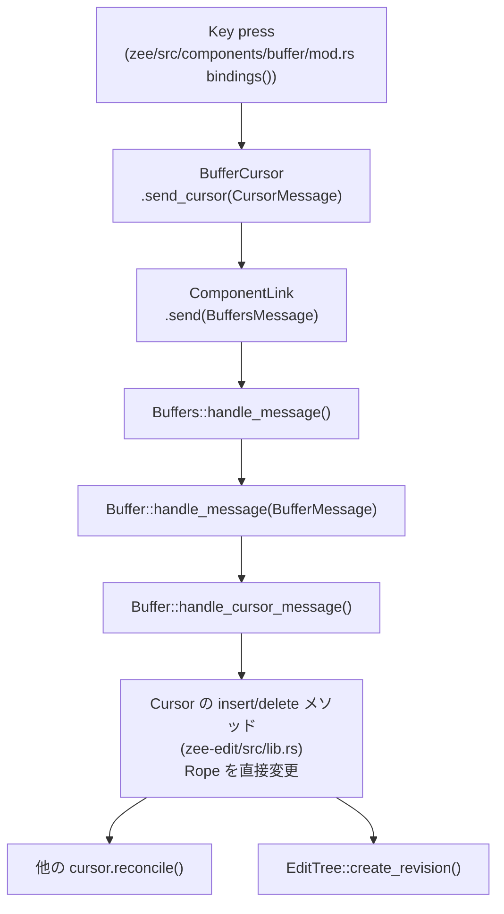

## 1. 現在の編集処理の流れ

### keybinding → Rope/Cursor 変更までのメッセージパス



1. `Buffer` コンポーネント (`zee/src/components/buffer/mod.rs`) の `bindings()` でキー入力を受け取り、`BufferCursor` のメソッドを呼ぶ [0-cite-0](#0-cite-0) 

2. `BufferCursor::send_cursor()` が `CursorMessage` を `BufferMessage::CursorMessage` でラップし、`ComponentLink<Editor>` 経由で `Editor` に送信する [0-cite-1](#0-cite-1) 

3. `Buffers::handle_message()` が `BufferId` で対象 `Buffer` を特定し、`Buffer::handle_message()` に転送 [0-cite-2](#0-cite-2) 

4. `Buffer::handle_cursor_message()` は **2フェーズ**で処理する:
   - **Phase 1（stateless）**: movement 系と selection 系（`BeginSelection`, `ClearSelection`, `SelectAll`）。Rope を変更しない
   - **Phase 2（editing）**: `insert_char`, `delete_forward`, `CopySelection` 等。`OpaqueDiff` を返す [0-cite-3](#0-cite-3) 

5. diff が non-empty の場合、他カーソルの `reconcile()` → `EditTree::create_revision()` → `update_parse_tree()` が順に実行される [0-cite-4](#0-cite-4) 

### selection / copy / cut / paste に関する主要ファイルと型

| ファイル | 役割 |
|---|---|
| `zee-edit/src/lib.rs` | `Cursor` struct（`range`, `selection`, editing メソッド全般） |
| `zee-edit/src/diff.rs` | `OpaqueDiff`, `DeleteOperation` |
| `zee-edit/src/movement.rs` | movement 関数群（`move_horizontally`, `move_vertically` 等） |
| `zee-edit/src/tree.rs` | `EditTree`, `Revision`, undo/redo |
| `zee/src/editor/buffer.rs` | `Buffer`, `BufferCursor`, `CursorMessage`, `BufferMessage`, clipboard 操作実装 |
| `zee/src/clipboard.rs` | `Clipboard` trait, `LocalClipboard` / `SystemClipboard` |
| `zee/src/components/buffer/mod.rs` | keybinding 定義、UI コンポーネント |
| `zee/src/components/buffer/textarea.rs` | `TextArea` 描画 |
| `zee/src/syntax/highlight.rs` | `text_style_at_char()`（cursor/selection スタイル判定） | [0-cite-5](#0-cite-5) [0-cite-6](#0-cite-6) 

---

## 2. 現在の selection model

### `Cursor.range` が表すもの

`range: Range<CharIndex>` はカーソル位置にある **1グラフェムクラスタ** の開始・終了を表す。バッファ末尾では `range.start == range.end`（空 range）になる。常にグラフェム境界に揃えられている。

```rust
pub struct Cursor {
    range: Range<CharIndex>,          // 現在のグラフェムクラスタ
    selection: Option<CharIndex>,     // 選択開始のアンカー点
    visual_horizontal_offset: Option<usize>,  // sticky column
}
``` [0-cite-7](#0-cite-7) 

### `Cursor.selection` が表すもの

`selection: Option<CharIndex>` は **選択モードのアンカーポイント**。`begin_selection()` で `Some(range.start)` がセットされ、以降カーソルが移動すると `range.start` が移動端、`selection` が固定端となる。

```rust
pub fn begin_selection(&mut self) {
    self.selection = Some(self.range.start)
}
``` [0-cite-8](#0-cite-8) 

### `Cursor::selection()` → linear range への変換

`selection()` は `selection` と `range.start` を比較して **正規化された `Range<CharIndex>`** を返す。選択がなければ `range.clone()` を返す。

```rust
pub fn selection(&self) -> Range<CharIndex> {
    match self.selection {
        Some(selection) if selection > self.range.start => self.range.start..selection,
        Some(selection) if selection < self.range.start => selection..self.range.start,
        _ => self.range.clone(),
    }
}
```

つまり**常に 1次元の連続 char range** として返される。方向に依存しない。 [0-cite-9](#0-cite-9) 

### selection がクリアされる箇所

| 操作 | 場所 |
|---|---|
| `C-g` keybinding | `cursor.clear_selection()` → `CursorMessage::ClearSelection` |
| `insert_char()` | メソッド冒頭で `self.clear_selection()` |
| `insert_chars()` | メソッド冒頭で `self.clear_selection()` |
| `delete_selection()` | 削除後に `*self = Cursor::with_range(...)` で selection を含むカーソルごとリセット |
| `copy_selection_to_clipboard()` | copy 後に明示的に `clear_selection()` | [0-cite-10](#0-cite-10) [0-cite-11](#0-cite-11) [0-cite-12](#0-cite-12) 

### clipboard 操作の責務

**`copy_selection_to_clipboard`** (`Buffer` メソッド):
- `cursor.selection()` で range 取得 → `content.slice()` で文字列抽出 → `clipboard.set_contents()` → `clear_selection()`
- diff は `OpaqueDiff::empty()` を返す（テキスト変更なし） [0-cite-12](#0-cite-12) 

**`cut_selection_to_clipboard`** (`Buffer` メソッド):
- `cursor.delete_selection()` で Rope から削除 → 削除テキストを clipboard へ → diff を返す [0-cite-13](#0-cite-13) 

**`paste_from_clipboard`** (`Buffer` メソッド):
- `clipboard.get_contents()` → `cursor.insert_chars()` で Rope にフラットに挿入
- 改行を含む文字列もそのまま1次元文字列として挿入される [0-cite-14](#0-cite-14) 

`Clipboard` trait 自体は `get_contents() -> String` / `set_contents(String)` だけのシンプルなインタフェースで、`LocalClipboard`（内蔵）と `SystemClipboard`（crossclip、feature flag 依存）の2実装がある。 [0-cite-15](#0-cite-15) 

---

## 3. rendering 側の見え方

### TextArea の描画フロー

`TextArea::draw_line()` がグラフェムごとにループし、各 `char_index` に対して `text_style_at_char()` を呼んでスタイルを決定する。 [0-cite-16](#0-cite-16) 

### `text_style_at_char` のスタイル判定ロジック

3段階の優先度で `background` を決定する:

```rust
// 1. カーソル位置のグラフェム → cursor style (最優先)
if char_index == cursor.range().start || cursor.range().contains(&char_index) {
    // cursor_focused or cursor_unfocused
}
// 2. selection 範囲内 → selection_background
else if cursor.selection().contains(&char_index) {
    theme.selection_background
}
// 3. カーソル行 → text_current_line, それ以外 → text.background
```

**重要**: `cursor.selection()` は毎回呼ばれ、selection が `None` のとき `range.clone()` を返す。つまり **selection が None でも cursor の grapheme range と同じ range が返される**ため、selection 判定は事実上 cursor 位置判定の後に来ることで問題にならない。 [0-cite-17](#0-cite-17) 

### `Cursor.range` の持ち方が見た目に影響する箇所

- `TextArea` は `BufferView` 構築時に `self.properties.cursor.inner().clone()` でスナップショットを取る。レンダリング中は不変。 [0-cite-18](#0-cite-18) 
- `StatusBar` は `content.char_to_line(cursor.range().start)` でカーソル行、`cursor.column_offset()` で表示列を計算 [0-cite-19](#0-cite-19) 
- `ensure_cursor_in_view()` は `cursor.range().start` からスクロール位置を決定 [0-cite-20](#0-cite-20) 
- `draw_line()` 末尾で、行末に `\n` がなく `cursor.range().start == char_index` の場合に仮想カーソル（スペース1文字）を描く [0-cite-21](#0-cite-21) 

`selection_background` はテーマ内で `Background` 型（= `Colour`）のみ。`Style` ではないため、foreground は通常の syntax style のものがそのまま使われる。 [0-cite-22](#0-cite-22) 

---

## 4. 矩形選択を追加するときに壊しやすそうな前提

### data model

- **`Cursor.selection` が `Option<CharIndex>` 1個**である点が最大の制約。矩形選択は (行, 列) の2次元アンカーか、行ごとの range リストが必要だが、現在は 1次元 char offset 1個しか保持していない。 [0-cite-23](#0-cite-23) 
- `Cursor::selection()` は常に **単一連続 `Range<CharIndex>`** を返す。矩形選択では行ごとに不連続な range 群になるため、この戻り値型が壊れる。 [0-cite-9](#0-cite-9) 

### clipboard

- `Clipboard` trait は `String` を出し入れするだけで、**「矩形で切った」というメタ情報を持たない**。paste 時に矩形として復元するには追加情報が必要。 [0-cite-24](#0-cite-24) 
- `paste_from_clipboard` は `insert_chars()` でフラットに挿入するのみ。矩形 paste（行ごとに挿入位置をずらす）には全く対応していない。 [0-cite-14](#0-cite-14) 
- `copy_selection_to_clipboard` は `content.slice(start..end)` で連続 slice を取得する。矩形では行ごとに slice して改行で繋ぐ処理が必要。 [0-cite-12](#0-cite-12) 

### edit / undo

- `OpaqueDiff` は **単一連続領域** の変更しか表現できない（`char_index` + old/new length）。矩形 cut/paste は複数行にまたがる不連続な変更となり、1つの `OpaqueDiff` では表現不可能。 [0-cite-25](#0-cite-25) 
- `EditTree::create_revision()` は `OpaqueDiff` 1つを受け取るため、複数 diff をまとめる仕組みがない。undo 1回で矩形操作全体を巻き戻すには、revision の作り方を変えるか、複合 diff が必要。 [0-cite-26](#0-cite-26) 
- `Cursor::reconcile()` も `OpaqueDiff` 1つを前提としてカーソル位置を調整する。 [0-cite-27](#0-cite-27) 
- `insert_char` / `insert_chars` は冒頭で `clear_selection()` を呼ぶため、矩形選択中に1文字入力すると選択が消える前提。 [0-cite-11](#0-cite-11) 

### rendering

- `text_style_at_char()` は `cursor.selection().contains(&char_index)` で1次元 range の包含判定をしている。矩形選択では各行の visual column range を計算して判定する必要がある。 [0-cite-28](#0-cite-28) 
- `draw_line()` はグラフェムごとにスタイルを取得するが、visual column 情報（`visual_x`）は `text_style_at_char()` に渡されていない。矩形ハイライトには `visual_x` が必要。 [0-cite-29](#0-cite-29) 
- `ensure_cursor_in_view()` は `range.start` のみでスクロール判定する。矩形選択のアンカー端が画面外に出たときの挙動は未考慮。

### grapheme width / tab width / CJK width

- `graphemes::width()` は `UnicodeWidthStr::width()` を使うため CJK は幅2として計算される。矩形選択のカラム計算もこれに依存する必要がある。 [0-cite-30](#0-cite-30) 
- Tab は `tab_width` 分のスペースとして表示される。矩形選択の列範囲計算で tab をまたぐケースのエッジケースが発生する。
- `move_vertically()` の sticky column (`visual_horizontal_offset`) は `graphemes::width()` で計算されるため、矩形選択のカラムアンカーもこれと整合性を取る必要がある。 [0-cite-31](#0-cite-31) 

---

## 5. 追加でエージェントに調査させるべき未確認点

### selection のテストが無い

`zee-edit` 内のテストを確認したところ、`begin_selection()`, `clear_selection()`, `select_all()`, `delete_selection()`, `selection()` に対する**直接的なユニットテストが存在しない**。movement と tree のテストは存在するが、selection の正規化ロジックや edge case のテストは見当たらなかった。 [0-cite-32](#0-cite-32) 

確認すべき点:
- `zee-edit/src/lib.rs` の `#[cfg(test)] mod tests` の内容全体を精読して、selection 関連テストの有無を最終確認する
- `delete_selection` のテストが無い場合、矩形選択の前に既存 selection の振る舞いを保護するテストを先に追加すべき

### `Cursor` の `pub(crate)` フィールドアクセス

`movement.rs` は `cursor.range` と `cursor.visual_horizontal_offset` に**直接アクセス**している（`pub(crate)` レベル）。`Cursor` のフィールド構造を変更する場合、`movement.rs` 全体が影響を受ける。フィールドの可視性を実コードで確認すべき。 [0-cite-33](#0-cite-33) 

### `reconcile()` の正確な挙動

`reconcile()` の `modified_range` 計算 `char_index..max(old_char_length, new_char_length)` はコメントで「conservative bounding box」と説明されているが、`char_index` が開始で `max(old, new)` が終了というのは **長さではなく index として使っている** ように見える。実コードを再読して意図が正しいか確認すべき。 [0-cite-27](#0-cite-27) 

### `zi` フレームワーク側の制約

- `Canvas::draw_graphemes()` や `Canvas::draw_str()` が CJK 幅2のグラフェムをどう扱うか（カラム跨ぎの描画）
- `zi` の `Bindings` API が modifier + arrow key（例: `Shift+Up`）をサポートしているか — README の TODO に「`Alt + arrow key` は `zi` が未対応」との記載がある [0-cite-34](#0-cite-34) 

### テストカバレッジの一覧

各ファイルのテスト数:

| ファイル | `#[test]` 数 | 内容 |
|---|---|---|
| `zee-edit/src/lib.rs` | 7 | insert/delete 系 |
| `zee-edit/src/movement.rs` | 7 | move 系 |
| `zee-edit/src/tree.rs` | 5 | undo/redo/revision |
| `zee-edit/src/graphemes.rs` | 2 | multi-char emoji boundary |
| `zee-edit/src/diff.rs` | 1 | mem size_of |

clipboard 系（`copy_selection_to_clipboard` / `cut_selection_to_clipboard` / `paste_from_clipboard`）のテストは `zee` crate 側にあるか不明。`zee/src/editor/buffer.rs` のテスト有無を確認すべき。

### 実コード精読の推奨箇所

1. **`zee-edit/src/lib.rs` の `mod tests`** — selection/delete_selection テストの有無
2. **`zee/src/editor/buffer.rs`** — `Buffer` struct のフィールド定義全体と `new()` の mode 解決ロジック
3. **`zi` crate の `Key` enum** — `Shift` modifier の有無（矩形選択のキーバインド設計に影響）
4. **`zee/src/components/buffer/textarea.rs`** の `draw_line()` — `visual_x` の計算がグラフェム幅と正確に一致しているかの検証
